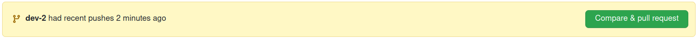
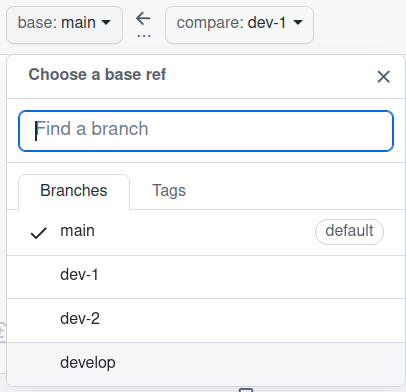
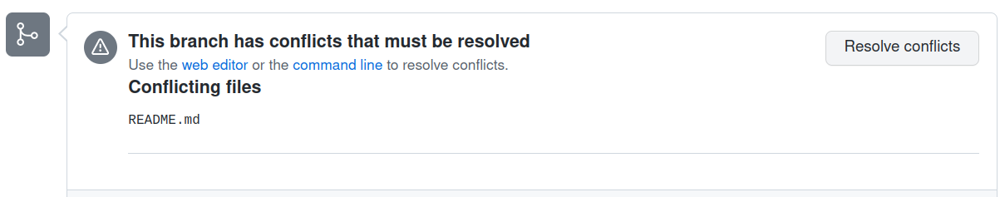
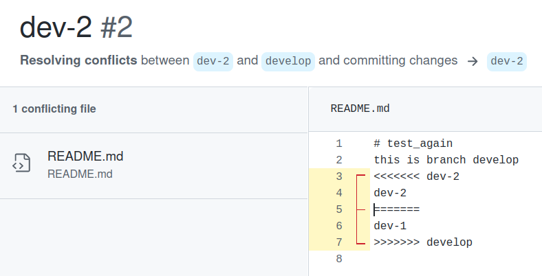
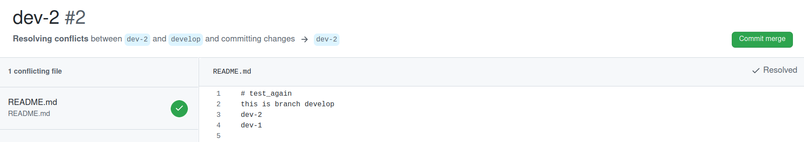

# Lab

Introduction to Git

## Objectives

This workshop can be done **in pairs**.

- Learn the basic git commands.
- Understand the data flow between the local and remote repository.
- Learn what the conflict is and how you manage it. 

## Before starting

1. Create a GitHub account: https://github.com/
2. Install an IDE or text editor (ex: https://code.visualstudio.com/ or https://atom.io/)
3. Install Git:

  - Windows: https://gitforwindows.org/
  - Linux: https://git-scm.com/download/linux
  - macOS: https://git-scm.com/download/mac

  You can now open Terminal (on Linux or macOS) or Git Bash (on Windows).

  You can find a detailed list of the different Git CLI commands:
  - https://gist.github.com/aquelito/8596717
  - https://github.github.com/training-kit/downloads/github-git-cheat-sheet.pdf

## 1. Create a repository and clone it on your computer

**A single member** of the group creates a repository:

1. Log in to [Github.com](https://github.com/).
2. Navigate to the **"Your repositories"** page.
3. Click on **"New"**:
  - Choose a name
  - Chose the **"Public"** option
  - Check the box **"Add a README file"**
  - Check the box **"Add .gitignore"** with the **"Python"** template.
4. Navigate to the created repository, then to the **Settings → Manage Access** page.
5. Click on **"Invite a collaborator"** and add the other member of your group.
6. **Both members** clone the repository. You now have a copy of the local repository.
7. Read **".gitignore" file**  and understand what it does.
8. **A single member** of the group creates the `develop` branch. He also creates **"README.md"** file if it doesn't exist. Write **the name of the branch** on row 2. Push the changes to the remote repository. 
9. **The other members** of the group synchronize their local repos with the remote repo (= get the changes from the remote repo).

## 2. Manage conflicts

A conflict occurs when the same part of a file has been modified on 2 branches which must be merged (**merge**). We will create a conflict to see how to resolve it.

Both **2 members** of the group create a branch from `develop` and modify the same part (same line) of the **README.md** file:

1. Create a branch `dev-firstname` from the `develop` branch.
2. Edit the **README.md** file: write the name of your proper branch (`dev-firstname`) on line 3.   
**Recall**: to create the conflict, both members must modify the same line.   
3. Commit changes.
4. Push your changes.

Alternately, each member merges the new branches into `develop` branch (on GitHub. **Make sure that is the develop branch you both are merging into.**):

5. Open the pull request.

  

6. Read the information that GitHub gives you about the branch comparison.
7. Merge the first `dev-firstname` branch into the **`develop`** branch.

  

8. Repeat the same steps for the second `dev-firstname`.
9. **The 2nd member** of the group will encounter a conflict:
  - Git will notify you that the branches cannot be merged automatically.
  - It will suggest you to still open the pull request and then to resolve the conflict. Open the IDE by clicking on the `Resolve conflicts`.

  

  - The conflict materializes as follows:
  
  

  - To resolve the conflict, keep either the `HEAD` part or the `dev-firstname` part and delete the other lines (including the `====` and `>>>>` lines)
  - Once the lines are deleted you can commit the merge:

  

## Bonus tasks

If you finished, pick a topic that interest you the most from the following list and try it put:

1. Learn [the difference between merge and rebase](https://dzone.com/articles/merging-vs-rebasing)
2. Learn [Conventional Commits](https://www.conventionalcommits.org/en/v1.0.0-beta.2/) - a specification for adding human and machine readable meaning to commit messages.
3. Learn **squashing** commits (reference [here](https://git-scm.com/book/en/v2/Git-Tools-Rewriting-History) and [here](https://stackoverflow.com/questions/5189560/squash-my-last-x-commits-together-using-git))
4. Add multiple remotes (reference [here](https://git-scm.com/book/en/v2/Git-Basics-Working-with-Remotes))
5. Reverting history (reference [here](https://gist.github.com/gunjanpatel/18f9e4d1eb609597c50c2118e416e6a6) and [here](https://stackoverflow.com/questions/1270514/undoing-a-git-push))
6. Rebasing (reference [here](https://git-scm.com/book/en/v2/Git-Branching-Rebasing))
7. Cherry-picking (reference [here](https://git-scm.com/docs/git-cherry-pick) and [here](https://git-scm.com/docs/git-cherry-pick))
8. Learn Monorepos in Git (reference [here](https://www.atlassian.com/git/tutorials/monorepos))
