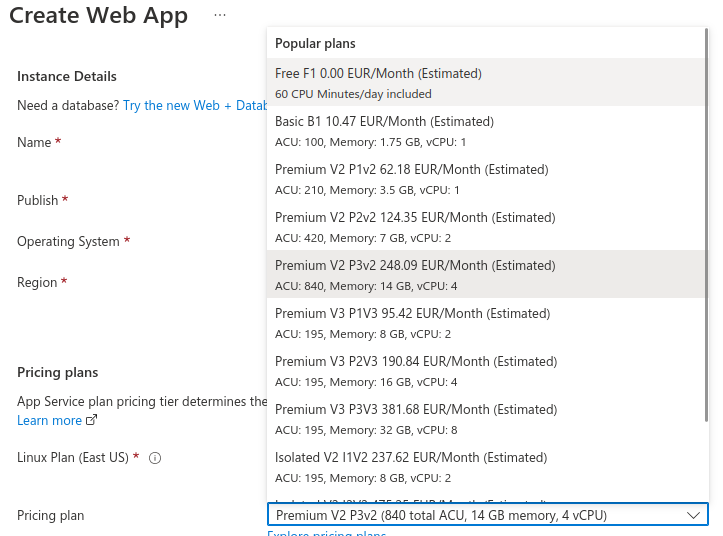
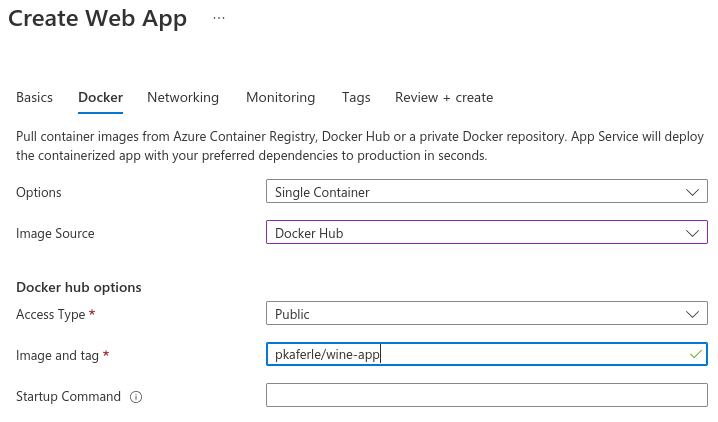

## Deploy a model

### Prepare and test the app locally

**Objectives:**

- See the steps of a model deployment.

**Dependencies:**

- script: `model.py`. You start with this one and follow the tutorial. It is the same elastin cet model that we were using before.

**Instructions:**

By now, we created and tested a model. But we only have a source code, which is not enough to deploy. First we need to save the model we want to deploy as a .bin file. Add the following code to the end of the `model.py`. Run it (in corresponding virtual enviromnent) to produce the pickled model.

``` python
import pickle
##dump the model into a file
with open("model.bin", 'wb') as f_out:
    pickle.dump(lr, f_out) # write final_model in .bin file
    f_out.close()  # close the file
```

Served model will predict wine quality, but we don't have the prediction function yet. Here is the function we will use (you will copy it to a file later).

``` python
import pandas as pd

def predict_wine_quality(data, model):
    
    if type(data) == dict:
        df = pd.DataFrame(data)
    else:
        df = data
    
    #y_pred = model.predict(df)
    y_pred = model.predict(df).round().astype(int)
    return y_pred
```

1. Create your working directory `mkdir wine_app`.

2. Look into `model.py` and find out which libraries you are using. Find out the exact versions of these libraries and write them in the `requirements.txt`. Save it to the `wine_app` directory.

3. To your virt. env. install `flask` and `gunicorn`. Look up the exact versions and add them to the requirements.

4. Deactivate current virtual environment and create a new one: `conda create --name env_wine_app python=3.9` and activate it.
  
5. Install the requirements: `pip install -r requirements.txt`. That way you will try to create the minimal required environmenent (without libraries that you may installed, but are not needed for the project). 
 
6. Create `main.py` in `wine_app` directory:

```python
from flask import Flask

##creating a flask app and naming it "app"
app = Flask('app')

@app.route('/test', methods=['GET'])
def test():
    return 'Pinging Model Application!!'

if __name__ == '__main__':
    app.run(debug=True, host='0.0.0.0', port=9696)
```

7. Run it in the terminal (be careful of folders and virt. env): `python main.py`.

8. Open the link written in the terminal and add `/test`. You will see if your setup is working or not.

9. Close it with `Ctrl+C`. If you close the terminal or open a new window, don't forget to reactivate the virtual environment: `conda activate env_wine_app`.  

10. In `wine_app` directory, create sub-directory `model_files`: `mkdir model_files`.

11. Inside `model_files` create `ml_model.py` and copy inside the `predict_wine_quality`function (above).

12. Copy pickled model `model.bin` to `model_files`.

13. In `model_files`, create empty `__init__.py` file to indicate that the directory is a package.

14. Go back to the `main.py` and add the following code:

Imports, including your prediction function:

```python
import pickle
from flask import Flask, request, jsonify
from model_files.ml_model import predict_wine_quality
```

Copy `predict` function and it's route (before the line `if __name__ == '__main__'`) :

```python
@app.route('/predict', methods=['POST'])
def predict():
    wine_sample = request.get_json()
    print(wine_sample)
    with open('./model_files/model.bin', 'rb') as f_in:
        model = pickle.load(f_in)
        f_in.close()
    predictions = predict_wine_quality(wine_sample, model)

    result = list(predictions)
    
    # To be able to serialize it (int64 not serialisable)
    formatted_result = []
    for el in result:
        formatted_result.append(int(el))
        
    return jsonify(formatted_result)
```

15. Save and go to the terminal. Close the terminal window running from before (from the `main.py /test` test). If needed, reactivate the `env_wine_app` and go to the `wine_app` directory. There, run `main.py`.
16. Open new text file (doesn't matter where) and copy inside (`test_app_locally.py`): 

```python
new_data = {
    'fixed acidity': [1.2, 2.3, 1.3],
    'volatile acidity': [0.1, 0.8, 0.7],
    'citric acid': [0.5, 1.7, 1.1],
    'residual sugar': [3.0, 13.0, 7.6],
    'chlorides': [2.0, 15.0, 13.4],
    'free sulfur dioxide': [10.0, 72.7, 75.0],
    'total sulfur dioxide': [33.0, 135.0, 67.0],
    'density': [0.99, 1.007, 1.0],
    'pH': [3.0, 9.0, 6.7],
    'sulphates': [0.3, 1.8, 0.9],
    'alcohol': [9.3, 13.4, 12.2]
    }

import requests

url = "http://localhost:9696/predict"
r = requests.post(url, json = new_data)
r.text.strip()
print(r.text.strip())
```

When you run it, it should return a list with predictions. If you get an error saying thet the module `requests` was not found, `pip install requests` and run it again.

**NOTE:** If you didn't run the `main.py` before and left it running, this will not work!

17. Note that when you ran Flask, you got a following message: **WARNING: This is a development server. Do not use it in a production deployment. Use a production WSGI server instead.** This is due to the fact that the server, containes in the Flask, is not production-ready, but it's only meant for testing. For a production, we will use **unicorn server**.

18. (This step mignt not work on Windows, so you can skip it.) The command `gunicorn --bind=0.0.0.0:9696 main:app` will start the gunicorn server, as we started the Flask server before.    

### Create Docker image

19. Check out the examples of the Dockerfiles from yesterday and create one to containerize your model. **Hint**: Instead of CMD, you will use `ENTRYPOINT ["gunicorn", "--bind=0.0.0.0:9696", "main:app"]` to start the app in the container.

20. Build the image and name it `wine-app`.

21. Run the container: `docker run -it --rm -p 9696:9696 wine-app:latest`

22. Test it again with the `test_app_locally.py` and stop it (`Ctrl+C`).

23. Tag the image properly and push it to the Docker Hub (check yesterday's lab).

### Deploying the container to Azure Web Services

##### Create your account

First create you account. You have two options:

- [Student account](https://azure.microsoft.com/en-us/free/students/) povides 100$ credits available for 1 year.
- [Free trial account](https://azure.microsoft.com/en-us/free/) povides 200$ credits available for 1 month.

Then connect to your [azure portal](https://portal.azure.com/)

##### Create Web App

24. In the Azure portal browser search for `App Services`.


25. Click on `+ Create`.


26. Fill in the details:
	- your subscription name
	- resource group: `create new` and give it a name
	- name for you instance (app)
	- publish as **Docker container**
	- region **France central**
	- pricing plan: **make sure that you select free pricing plan!**
	- click `Next: Deployment` at the bottom of the page
	

	
27. On the next page fill in the details about the Docker container you are deploying. 



28. Click on `Review+Create` on the bottom of the page.

29. When your app is deployed, go to resource. Copy the `URL`.

30. Open the `test_app_locally.py` and replace `url = "http://localhost:9696/predict"` with your apps' URL: `url = "https://<app-azure-url>/predict"`.

31. Run the script to see if it's working. When you do it for the first time, it might take long for the pp to respond and you might want to repeat it several times.

## Resources:

- [Deploying Machine Learning Models with Flask and Docker](https://www.youtube.com/watch?v=KTd2a1QKlwo&list=WL&index=1)
- [Tip 12: Deploying a container image to Azure App Service from Docker Hub](https://www.youtube.com/watch?v=_LNOg8kU4CE)


