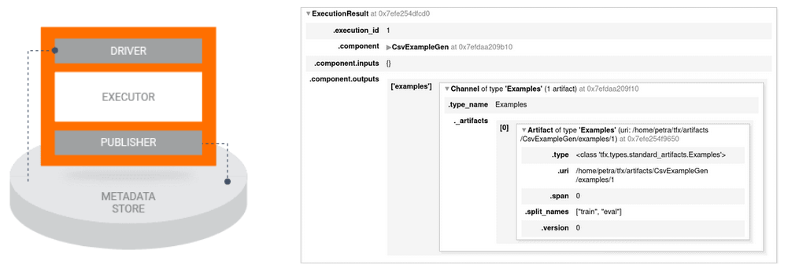

# End-to-end ML platforms

## Until now we saw...

- Getting a model to production takes many steps
- Many different stakeholders will participate
- Many different tools will be used
- Even after the deployment the pipelines will evolve
- **=> The process is complex and it takes lots of time and maintenance**

## Solution

- A tool that treats multiple steps from development to deployment: **end-to-end ML platform**
- More and more platforms is appearing
- Several are open-source, mostly they are managed
- They mostly started as in-house solutions (Google, Uber, Netflix, AirBnB...)
- They focus on different parts of the process (no unified definition)
- Can be framework-specific (TensorFlow Extended) or framework agnostic (Liminal) (both open-source)  
- Cloud providers offer many services, including MLOps toolstacks

## Platform comparison

[Check out the link](https://valohai.com/mlops-platforms-compared/)

## TensorFlow Extended (TFX)

- Google’s solution for deploying their proper models
- Robust and scalable
- Open-sourced in 2019

[TFX official site](https://www.tensorflow.org/tfx)

### How it works

- It is based on **TensorFlow libraries**
- Many libraries: potential problems with compatibility

![Libraries][./assets/libraries_components.png]

- Modular: modules can be used independently or to build pipelines
- Output from one module is input for the next one
- Reduction of boilerplate code to connect modules and make the pipeline work

### Metadata store

- Stores the information about the state of the system after an execution of a component
- Stores the outputs of the components:
  - Information about the models, the data they were trained on, and the evaluation metrics
  - Execution records for every component
  - Lineage of the data objects as they flow through the pipeline.
- Makes the pipeline data and task-aware

## Comparison of the initial pipeline and TFX

**Initial pipeline:**

**TFX:**

